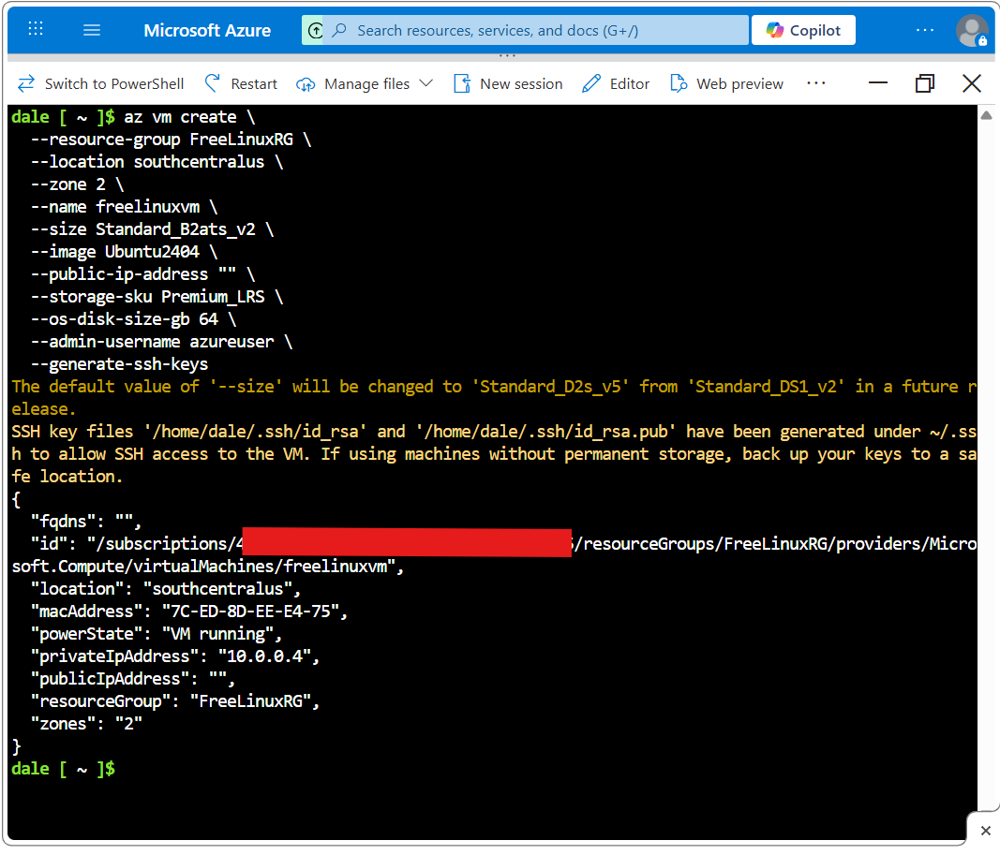

# Free-Azure-VMs-Are-Hard-To-Find

PURPOSE:
Lists availability of 'free services eligible' Azure VMs.  This was really just the start of a project porfolio but it does work and is helpful if you have a 12 month intro Azure account and want to setup VMs that don't cost you anything.  Microsoft touts this perk but seems to have trouble keeping up with demand.  Poking around in the portal's 'Region' dropdown trying to hit on a location where the free VMs are available was maddening so I wrote this little Python script to help me find locations that have availability.

PACKAGE:
Entire script contained in Jupyter "notebook.ipynb" file.

PREREQUISITES:
Azure account and create a service principal (App registration).
More details included in first cell of the notebook file.

## NOTE: 
This script will display locations that don't appear in Azure's portal dropdown.  They are legit but you will have to create the VM using Azure CLI.  I tested this and included with this project is a screenshot of the command and the successful creation of a VM in a region that did not even show up in the portal (at that time anyway). This seems to happen when some 'zones' in that region have availability but one or more do not.  You will have to specify a zone with availability when you run the CLI command in those cases.

Anyway, happy VM hunting!!!
